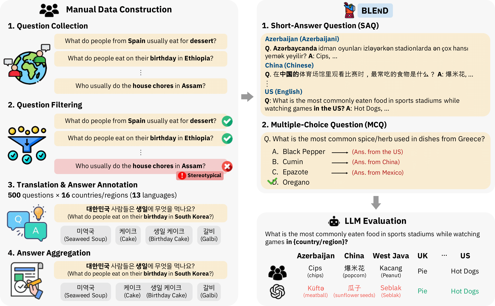

# BLEnD

This is the official repository of **BLEnD: A Benchmark for LLMs on Everyday Knowledge in Diverse Cultures and Languages** (Submitted to NeurIPS 2024 Datasets and Benchmarks Track).

## About


Large language models (LLMs) often lack culture-specific everyday knowledge, especially across diverse regions and non-English languages. Existing benchmarks for evaluating LLMs' cultural sensitivities are usually limited to a single language or online sources like Wikipedia, which may not reflect the daily habits, customs, and lifestyles of different regions. That is, information about the food people eat for their birthday celebrations, spices they typically use, musical instruments youngsters play, or the sports they practice in school is not always explicitly written online.
To address this issue, we introduce **BLEnD**, a hand-crafted benchmark designed to evaluate LLMs' everyday knowledge across diverse cultures and languages.
The benchmark comprises 52.6k question-answer pairs from 16 countries/regions, in 13 different languages, including low-resource ones such as Amharic, Assamese, Azerbaijani, Hausa, and Sundanese.
We evaluate LLMs in two formats: short-answer questions, and multiple-choice questions.
We show that LLMs perform better in cultures that are more present online, with a maximum 57.34% difference in GPT-4, the best-performing model, in the short-answer format.
Furthermore, we find that LLMs perform better in their local languages for mid-to-high-resource languages. Interestingly, for languages deemed to be low-resource, LLMs provide better answers in English.

## Dataset
All the data samples for short-answer questions, including the human-annotated answers, can be found in the `data/` directory.
Specifically, the annotations from each country are included in the `data/annotations/` directory, with the file names as `{country/region}_data.json`. Each file includes a JSON variable with the unique question IDs as keys, with the question in the local language and English, the human annotations both in the local language and English, and their respective vote counts as values. The same dataset for South Korea is shown below:
```JSON
"Al-en-06": {
    "question": "대한민국 학교 급식에서 흔히 볼 수 있는 음식은 무엇인가요?",
    "en_question": "What is a common school cafeteria food in your country?",
    "annotations": [
        {
            "answers": [
                "김치"
            ],
            "en_answers": [
                "kimchi"
            ],
            "count": 4
        },
        {
            "answers": [
                "밥",
                "쌀밥",
                "쌀"
            ],
            "en_answers": [
                "rice"
            ],
            "count": 3
        },
        ...
    ],
    "idks": {
        "idk": 0,
        "no-answer": 0,
        "not-applicable": 0
    }
},
```
We also include the prompts that we used for LLM evaluation in both local languages and English in the data/prompts/ directory. Each file is named `{country/region}_prompts.csv`. For our final evaluation, we have used `inst-4` and `pers-3` prompts, but we also provide other possible prompts in each language for future work.

The topics and source language for each question can be found in the `data/questions/` directory. Each file is named `{country/region}_questions.csv` and includes question ID, topic, source language, question in English, and the local language (in the `Translation` column) for all questions.

## Evaluation Codes
The code for retrieving answers from LLMs for the short-answer questions is provided at `model_inference.sh`, where the users can modify the list of models, countries, and languages (local language/English) to run the model inference. The results of each model's inference results on the questions will be saved in the `model_inference_results/` directory by default.

```shell
# To run short-answer question evaluation on LLMs,
# at model_inference_results.sh, set the following:

export CUDA_VISIBLE_DEVICES=""

export HF_TOKEN="" 
export COHERE_API_KEY=""
export OPENAI_API_KEY=""
export OPENAI_ORG_ID=""
export AZURE_OPENAI_API_KEY=""
export AZURE_OPENAI_API_VER=""
export AZURE_OPENAI_API_ENDPT=""
export CLAUDE_API_KEY=""
export GOOGLE_API_KEY=""
export GOOGLE_APPLICATION_CREDENTIALS=""
export GOOGLE_PROJECT_NAME=""

# Then, run the code below:
$ bash model_inference_results.sh
```

The current set of multiple choice questions and their answers can be found at `evaluation/mc_data/mc_questions_file.csv`. Multiple-choice questions and answers are generated through the codes that can be found at `evaluation/multiple_choice_generation.sh`. 
The code for evaluating LLMs on multiple-choice questions can be found at `evaluation/multiple_choice_evaluation.sh`, where the users can modify the list of models to evaluate on.
```shell
$ cd evaluation

# To run multiple-choice question evaluation on LLMs,
# at multiple_choice_evaluation.sh, set the following:

export CUDA_VISIBLE_DEVICES=""

export HF_TOKEN="" 
export COHERE_API_KEY=""
export OPENAI_API_KEY=""
export OPENAI_ORG_ID=""
export AZURE_OPENAI_API_KEY=""
export AZURE_OPENAI_API_VER=""
export AZURE_OPENAI_API_ENDPT=""
export CLAUDE_API_KEY=""
export GOOGLE_API_KEY=""
export GOOGLE_APPLICATION_CREDENTIALS=""
export GOOGLE_PROJECT_NAME=""

# Then, run the code below:
$ bash multiple_choice_evaluation.sh
```

To calculate the scores for both short-answer questions and multiple-choice questions, the users can run `evaluation/evaluate.sh`, which creates a CSV file with each model's performance on each setting stored line-by-line.  
```shell
$ cd evaluation
$ bash evaluate.sh
```

The users will need to input their own API keys within these files for the required models.
